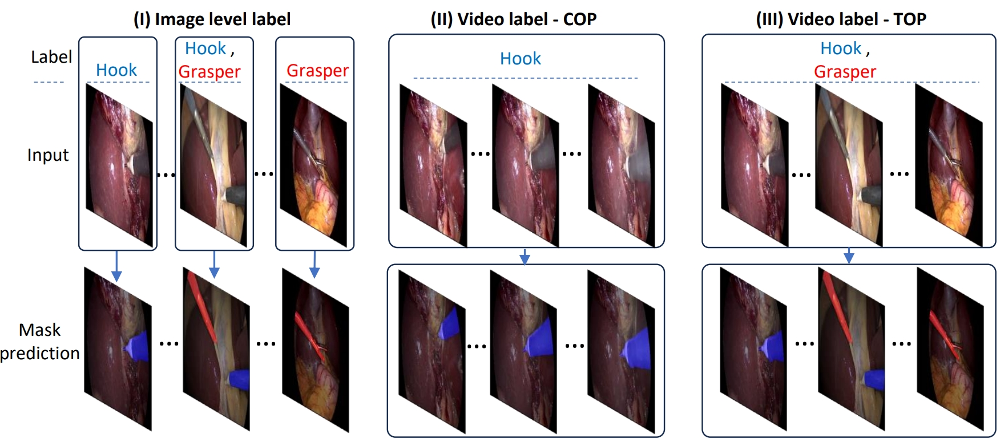
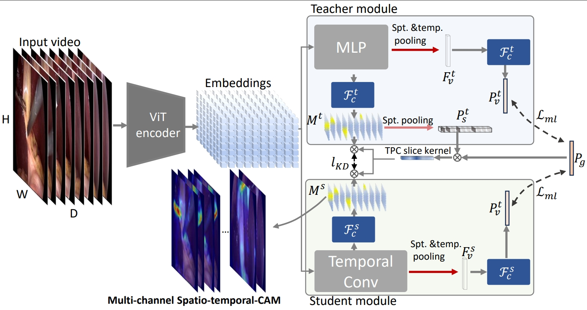
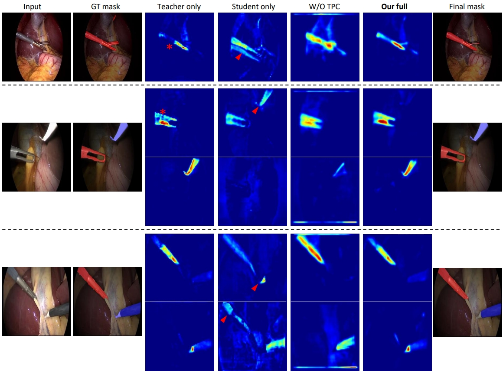
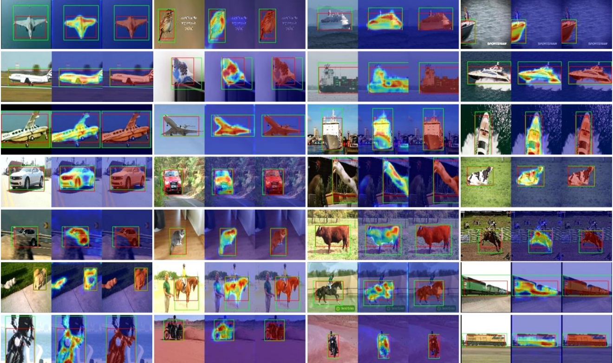

# VDST-Net: Disentangling spatio-temporal knowledge for weakly supervised surgical tool segmentation in video

## Description
This is an official PyTorch implementation of the VDST-Net model. 
> [VDST-Net: Disentangling spatio-temporal knowledge for weakly supervised surgical tool segmentation in video](https://arxiv.org/abs/2407.15794)

> [Presentation video](https://video.computer.org/WACV-Posters25/3qQJXCcJnCTXJ7fltwoLiT-WACV25-1620.mp4)

## Updates
* **2024.07.23:** Added implementation of VDST-Net, along with the data curation code of Transient Object Presence Cholec80 dataset.

## Hightlights

Weakly supervised detection/segmentation in videos could be categorized as three types. Type I has image-level presence labels available, and research for this task usually builds on WSSS adding temporal  constraints to improve prediction. Type II WSVOS with consistent object presence (COP) only has video-level labels, and the object is assumed to be in the video for most of the frames (this is the scenario for some public general video datasets). Type III WSVOS with transient object presence is the most challenging, where the label only indicates the presence of objects for the whole video, yet each object may be present in the video temporarily (i.e., in only a subset of frames).

  

The core of the framework consists of a teacher-student network pair designed to disentangle spatial and temporal knowledge. Both modules utilize a Sptio-temporal CAM and share input from a VIT encoder. The primary distinction between the teacher and student lies in their upper-layer feature extraction: the teacher employs an MLP module, while the student module uses a temporal convolutional network. This design constrains the teacher's temporal interaction to overcome activation conflicts, while gradually increasing student's learning capability to reason over time.
We utilize a semi-decoupled distillation mechanism, supervising teacher and student models with identical video labels while enabling efficient knowledge transfer via gated activation maps. Despite the teacher's powerful backbone and its ability to generate activation maps with a high degree of accuracy it still has detection gaps. Although the resulting supervision signal is not perfect,  semi-decoupled distillation allows the student to use the teacher CAMs information efficiently while adding temporal context.

  

The challenge imposed by the high uncertainty of the label is amplified in the TOP situation. The results highlight the significance of semi-decouple knowledge distillation through teacher and student modules for enhanced segmentation accuracy. A standalone student module, lacking frame-level supervision, shows a notable decline in segmentation performance (Dice score from 67.80\% to 47.64\%), because it predicts error activation by taking information from wrong frames or features, pointed out by red arrowheads in the following figure. The teacher module has no such issue but lacks the ability to generate activation maps with good connectivity, as indicated by red asterisks in the figure 

  

Our method not only works for the surgical domain, also demonstrated superior performance on a general dataset: YouTube-Objects video data. Under the training condition of using only video-level label. Our method demonstrates robustness, producing activation maps and segmentation masks that accurately follow the objects' contours, with minimal false activation on the background.  

  

## Repository Overview

We are releasing our implementation primarily based on vision transformer backbones.  Our goal is to provide a concise and modularized implementation, while also allowing future studies to integrate other pretrained backbones, such as Resnet backbones pretrained on the ImageNet dataset, Or the resnet/Vit pretrained through CLIP.

Additionally, we are also sharing the data pre-processing script for cholec80 videos to convert it to Transient Object presence clips with video-level labels. We hope that our code release will inspire future research and facilitate the real-world application of our model.

* `main.py`: Model training and visualization
* `data_cholec_reader_convert.py`: Convert Cholec80 raw data to clips for training.
* `data_cholec_seg8k_convert.py`: Convert Cholec_seg8k with segmentation ground-truth to clips for evaluation
* `working_dir_root.py`: Default parameters and setting 
* `model`: Model code
    * `base_models.py`: code for basic MLP, 3D CNN structures
    * `model_KD.py`: Key implementation for the semi-decoupled Knowledge distillation 
    * `model_TC.py`: Teacher module based on MLP
    * `model_ST.py`: Student module based on 3DCNN
    * `vision_transformer.py`: ViT backbone, refer to [Vit pytorch implementation](https://github.com/rwightman/pytorch-image-models/blob/master/timm/models/vision_transformer.py)
* `data`: Code for data pre-processing
    * `data.py`: load data to batches, and preprocessing on-the-fly
     

## Setup and Installation

### Dependencies

Ensure you have the following installed:
- Python 3.x
- PyTorch
- torchvision
- PIL
- OpenCV

 

### Preparing Data

* download raw cholec80 data:
Cholec80 dataset: [Download Cholec80](https://s3.unistra.fr/camma_public/datasets/cholec80/cholec80.tar.gz)

* Use Dataset pre-processing Script: data_cholec_reader_convert.py
Convert the raw cholec80 data into pkls of video clips.

For YTOBJ dataset we downloaded from here: [Download YTOBJ](https://calvin-vision.net/datasets/youtube-objects-dataset/)

### Train the model 

 * pretrained backbone can be downloaded here: "https://upenn.box.com/s/nsukq51tbdxvlgh6lugnkvufnt42blk1".  paste the dino_deitsmall8_pretrain.pth under the config_root folder

* Training Script: main.py
 
To train the model, 
first, set your data storage dir in working_dir_root.py 
run:
python main.py --evaluation False  --visdom_flag False --display_flag False

To evaluate the model, and visualize activation maps, run:
python main.py --evaluation True  --visdom_flag False --display_flag True

## Coming soon
* Implementation with Resnet backbone
* Data parallelization for training
* Training and evaluation on the YouTube-objects dataset

 
